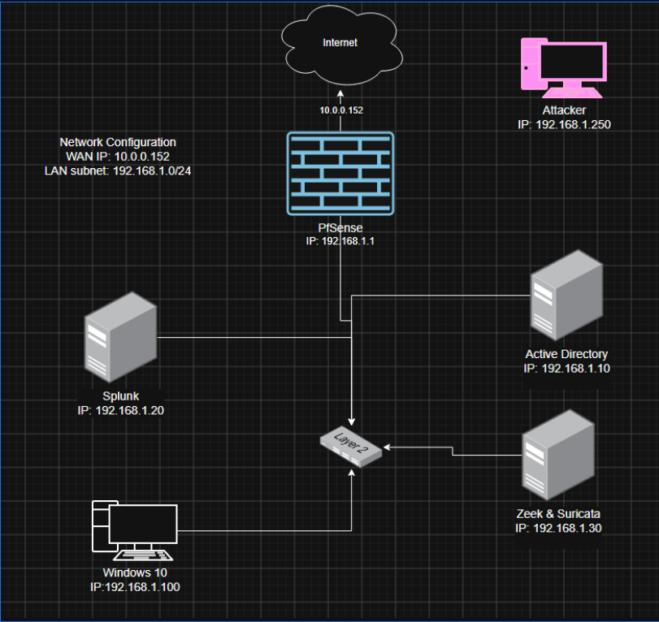
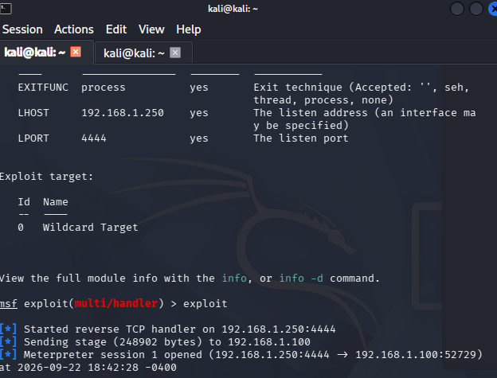
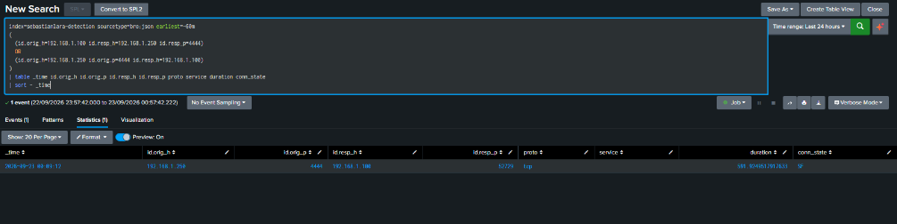
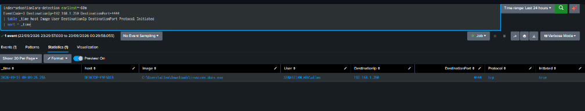

# Detection Lab

## Objective

Build and validate a small enterprise Detection Lab using pfSense as the network firewall and gateway, while centralizing Windows endpoint, Active Directory, and network telemetry in Splunk. The lab uses authorized, controlled adversary-simulation activity to verify that suspicious behavior can be detected, investigated, and correlated across Sysmon and Zeek.

### Skills Learned

- Built an isolated lab network using pfSense as the firewall and gateway for the 192.168.1.0/24 environment.
- Configured and validated centralized ingestion of Windows endpoint, domain-controller, and network telemetry in Splunk.
- Used SPL searches to investigate suspicious network connections and identify relevant IP addresses, ports, connection states, and session duration.
- Conducted and documented authorized simulated activity in an isolated lab environment to validate visibility across multiple telemetry sources.
- Correlated Sysmon Event ID 3 endpoint network connections with corresponding Zeek network telemetry in Splunk.
### Tools Used

- Splunk Security Information and Event Management (SIEM) system for log ingestion and analysis.
- Network analysis tools (Zeek and Suricata) for capturing and examining network traffic.
- PfSense firewall for network gateway services, traffic routing, and lab network isolation.
- Sysmon for detailed Windows endpoint telemetry, including process and network connection events.
- Kali Linux and Metasploit for authorized, controlled test activity.

## Lab Architecture

  

<em>Figure 1. Detection Lab network topology and telemetry sources.</em>

This Detection Lab simulates a small enterprise network protected by pfSense, with a `192.168.1.0/24` LAN. The environment includes an Active Directory domain controller (`192.168.1.10`), a Windows 10 endpoint (`192.168.1.100`), a Splunk SIEM server (`192.168.1.20`), and a Zeek/Suricata sensor (`192.168.1.30`). A Kali Linux host (`192.168.1.250`) is used to generate controlled test activity.

The lab forwards endpoint and domain-controller telemetry to Splunk through the Universal Forwarder, while the Zeek/Suricata sensor provides network telemetry for analysis. pfSense connects the lab LAN to the NAT-connected WAN (`10.0.0.152`) and serves as the network gateway.

## Detection Validation: Controlled Reverse TCP Session

To validate the lab’s endpoint and network visibility, I conducted an authorized, controlled reverse TCP session between the Kali Linux attack host (`192.168.1.250`) and the Windows 10 endpoint (`192.168.1.100`).

**Controlled test activity**

A reverse TCP session was established in the isolated lab environment to simulate suspicious command-and-control traffic.

**Network evidence — Zeek**

Zeek captured the matching TCP session in `conn.log` and forwarded the telemetry to Splunk. The event showed successful bidirectional communication between the Kali host on port `4444` and the Windows endpoint.

**Endpoint evidence — Sysmon**

Sysmon Event ID 3 recorded `C:\Users\allen\Downloads\invoices.docx.exe` initiating a TCP connection from the Windows endpoint to `192.168.1.250:4444`. This provided endpoint-level evidence of the same activity observed in Zeek.

**Result**

Correlating Sysmon endpoint telemetry with Zeek network telemetry confirmed the controlled reverse TCP session from both perspectives. This demonstrates the lab’s ability to centralize, investigate, and validate suspicious endpoint and network activity in Splunk.
